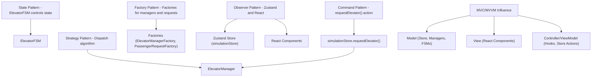
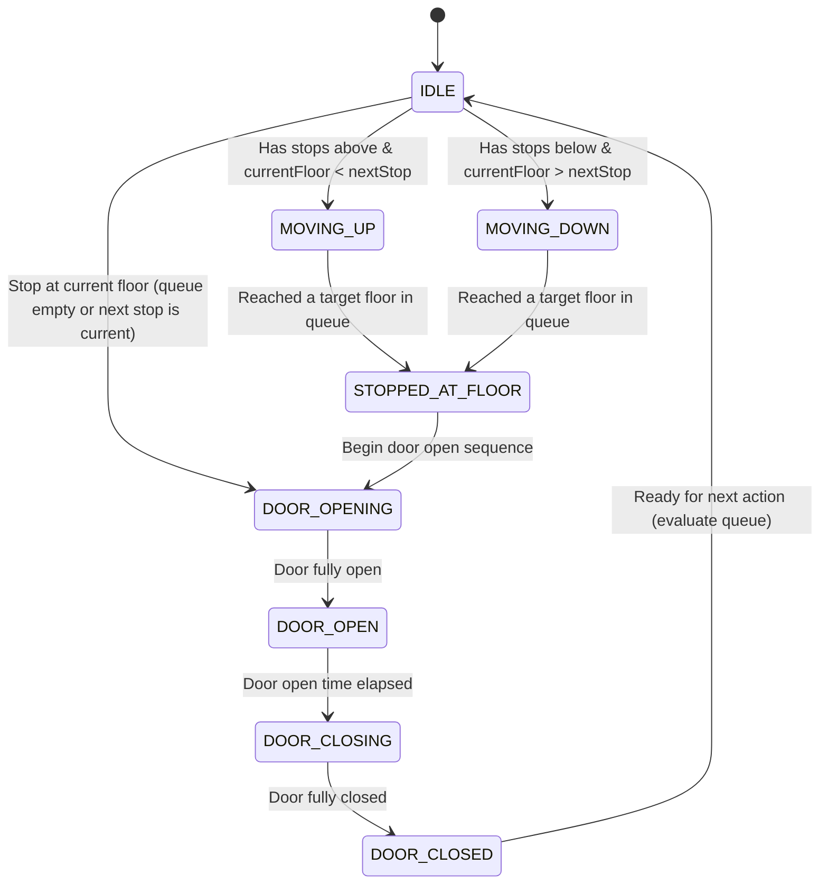
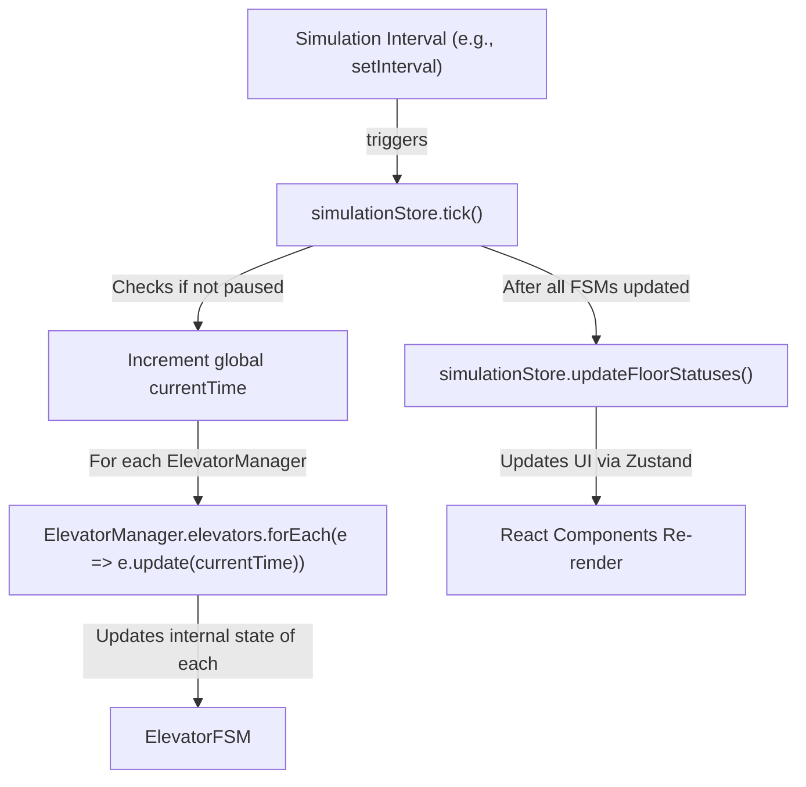
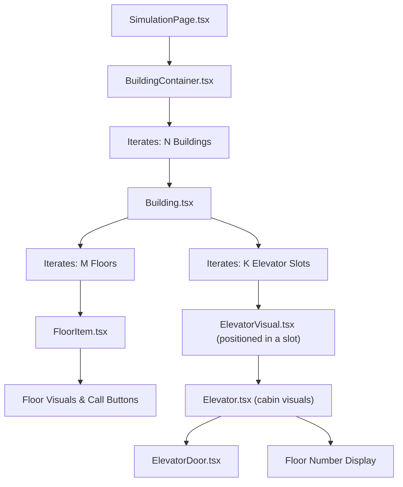
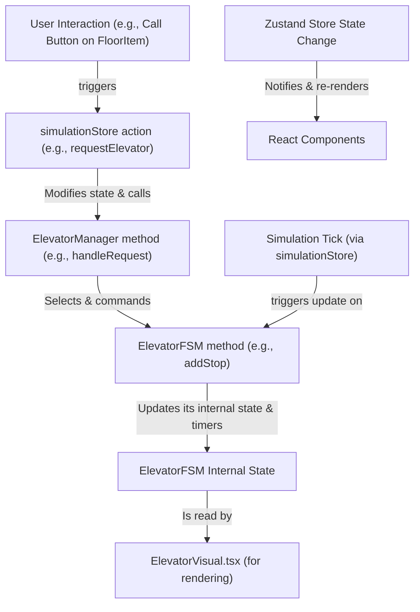
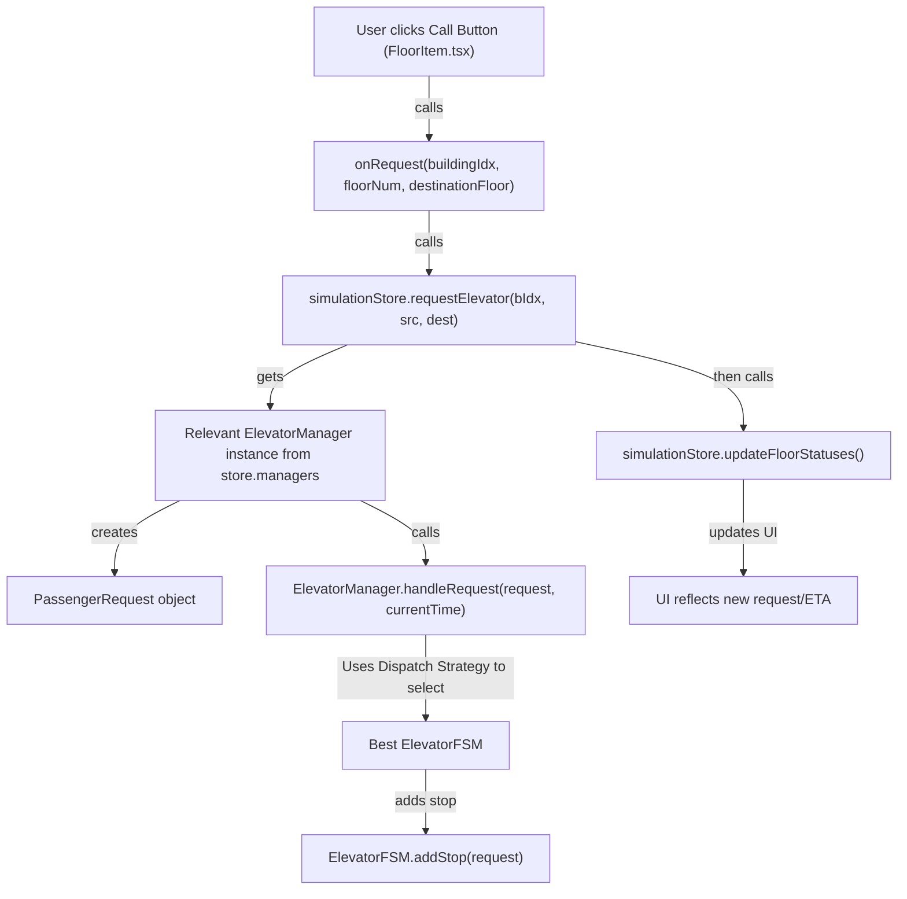

# Elevator Simulation System

A TypeScript + React-based elevator system simulation with modular architecture, real-time animations, and intelligent elevator dispatching.

---

## Key Functionality

*   **Multi-Building Simulation:** Simulate several buildings simultaneously, each with its own independent elevator system.
*   **Configurable Elevators:** Define the number of elevators per building, their initial floor, and various timing parameters (door speed, travel time per floor, stop delays).
*   **Dynamic Elevator Requests:** Users can request elevators to and from any floor within a building.
*   **Real-time Visual Representation:** A user interface displays the buildings, floors, and real-time movement of elevators, including door opening/closing animations, current floor indicators, and sound effects.
*   **Intelligent Dispatch Strategies:** Implement and switch between different algorithms for assigning elevators to requests (e.g., "ETA Only", "Scored Metric" considering queue length, direction, and capacity).
*   **Global & Per-Building Settings:** Configure default settings for all buildings and override them for specific buildings for fine-grained control.
*   **State Management:** Utilizes Zustand for robust and reactive state management of the entire simulation.
*   **Persistent Configuration:** Global settings are saved to and loaded from `localStorage` for user convenience.

---

## Tech Stack

-   **React + TypeScript:** For building a type-safe and modern user interface.
-   **Zustand:** For lightweight and flexible global state management.
-   **Framer Motion:** For smooth animations in the UI (e.g., elevator movement, doors).
-   **Object-Oriented Design:** Core logic encapsulated in classes like `ElevatorFSM`, `ElevatorManager`, and various Factories.
-   **Mermaid.js:** For generating diagrams directly within Markdown to visualize system architecture and flows.
-   **SCSS Modules:** For scoped styling of components.
-   **Zod:** For runtime type validation and schema enforcement.

---

## Design Principles

We implemented classic software engineering patterns to ensure scalability, maintainability, and clarity:

-   **State Pattern:** The `ElevatorFSM` (Finite State Machine) manages the various states of an elevator (e.g., `IDLE`, `MOVING_UP`, `STOPPED_AT_FLOOR`) and its transitions.
-   **Strategy Pattern:** The `ElevatorManager` can employ different dispatch strategies (e.g., shortest ETA, complex scoring) to select the optimal elevator for a request. This allows for easy extension with new algorithms.
-   **Factory Pattern:** Used for creating instances of `ElevatorManager` and `PassengerRequest`, decoupling the client code from concrete class instantiation.
-   **Observer Pattern:** Implicitly used through React's reactive updates and Zustand's subscription model, where UI components "observe" and react to changes in the simulation state.
-   **Command Pattern:** Actions like `requestElevator()` in the `simulationStore` can be seen as commands that encapsulate a request to perform an operation.
-   **MVC (Model-View-Controller) / MVVM (Model-View-ViewModel) Influence:**
    *   **Model:** `simulationStore`, `ElevatorManager`, `ElevatorFSM` (containing data and business logic).
    *   **View:** React components (displaying the simulation).
    *   **Controller/ViewModel:** Hooks and store actions (mediating between Model and View).

---

## Project Structure

```
elevator-simulator/
├── public/                  # Static assets (e.g., index.html, favicons)
├── src/
│   ├── assets/             # Images (elv.png), sounds (ding.mp3)
│   ├── components/         # React UI components
│   │   ├── buildingConfigDialog/     # Dialog for per-building settings (BuildingConfigDialog.tsx)
│   │   ├── buildingsComponents/      # Components for building visualization (BuildingContainer.tsx, Building.tsx, FloorItem.tsx)
│   │   ├── common/                   # Shared UI components (TimeDisplay.tsx, FormSection.tsx, NumberField.tsx, SelectField.tsx)
│   │   ├── elevatorComponents/       # Elevator visualization (ElevatorVisual.tsx, Elevator.tsx, ElevatorDoor.tsx)
│   │   ├── fullConfiguraions/        # Components for the global configuration page (GlobalBuildingSettings.tsx, etc.)
│   │   └── Layout.tsx               # Main application layout
│   ├── config/             # Configuration schemas and definitions
│   │   ├── buildingFieldSchema.ts   # Schema for building-specific form fields
│   │   └── settingsSchema.ts        # Zod schema for global application settings
│   ├── core/               # Core simulation logic
│   │   └── ElevatorManager.ts       # Manages a fleet of elevators for a building, including dispatch logic
│   ├── hooks/              # Custom React hooks
│   │   ├── useGlobalConfigForm.ts   # Logic for global settings form
│   │   ├── useBuildingOverrides.ts  # Logic for per-building overrides form
│   │   └── useEffectiveBuildingSettings.ts # Hook to get resolved (global + override) settings for a building
│   ├── interfaces/         # TypeScript interfaces and type definitions (IElevatorFSM, IElevatorManager, etc.)
│   ├── pages/              # Top-level page components (React Router routes)
│   │   ├── GlobalConfigPage.tsx     # Page for setting all configurations
│   │   ├── HomePage.tsx             # Landing/welcome page
│   │   └── SimulationPage.tsx       # Page for running and viewing the simulation
│   ├── services/           # Factory services (ElevatorManagerFactory, PassengerRequestFactory)
│   ├── store/              # Zustand global state management
│   │   └── simulationStore.ts       # Main store for simulation state, actions, and core logic integration
│   ├── types/              # TypeScript enums and global type declarations
│   │   ├── enums/                   # Application-specific enums (ElevatorState, DispatchStrategy, etc.)
│   │   └── assets.d.ts              # Type definitions for asset imports (e.g., .mp3, .png)
│   ├── utils/              # Utility functions (ETA calculation, localStorage helpers, floorHelpers.ts)
│   ├── App.tsx             # Main React application component with routing setup
│   └── main.tsx            # Application entry point (renders the React app)
├── .eslintrc.cjs
├── .gitignore
├── index.html
├── package.json
├── postcss.config.js
├── README.md               # This file!
├── tailwind.config.js
├── tsconfig.json
└── tsconfig.node.json
```

---

## System Architecture & Flow

<details>
<summary>Click to expand diagrams</summary>

### Design Patterns Overview


### ElevatorFSM – State Transitions


### Tick Flow – Simulation Clock Cycle


### Component Hierarchy (Simulation View)


### Zustand + FSM Data Flow (Simplified)


### requestElevator Flow


</details>

---

## How the Simulation Works

### Core Engine (`simulationStore.ts`)

The simulation's state and core loop are managed by a Zustand store (`src/store/simulationStore.ts`). This store holds:

- `managers`: An array of `IElevatorManager` instances, one for each simulated building.
- `settings`: The global application settings (`AppSettings`), loaded from localStorage or defaults.
- `buildingSpecificSettings`: A record of settings that override global defaults for individual buildings.
- `currentTime`: The current time in the simulation (in milliseconds), advanced by each tick.
- `isPaused`: A boolean indicating if the simulation's progression is paused.
- `floorStatuses`: Real-time status for each floor in each building (e.g., ETA for pickup, if an elevator is currently servicing it).

The simulation progresses via a `tick` function, typically called by a `setInterval`:

1. If not paused, the `currentTime` is incremented by `simulationTickMs`.
2. Each elevator's Finite State Machine (`IElevatorFSM`) is updated with the new `currentTime`. This is where elevators decide to move, open/close doors, etc., based on their internal queue and timing.
3. `floorStatuses` are recalculated based on the current state of all elevators in all buildings to update ETAs and service indicators on the UI.

### Elevator Management (`ElevatorManager.ts`)

Each building has its own `ElevatorManager` instance (`src/core/ElevatorManager.ts`), responsible for:

- **Managing all `IElevatorFSM` (elevator) instances** within that specific building.
- **Handling passenger requests** (`handleRequest`): When a user requests an elevator, the manager receives this request.
- **Dispatch Strategy**: The manager uses its configured dispatch strategy (e.g., `ETA_ONLY` or `SCORED_METRIC`) to select the most suitable elevator to handle the new request. The `scoredMetric` might consider factors like current ETA to the source floor, existing queue length, current direction of travel, and elevator load (if implemented).
- The chosen elevator's `addStop()` method is then called to add the new request (source and/or destination floors) to its queue.

Individual elevators (`IElevatorFSM`) are state machines that manage their own state (e.g., `IDLE`, `MOVING_UP`, `DOOR_OPEN`), current floor, a queue of stops (passenger requests), and internal timers for actions like door movements and travel between floors.

---

## Configuration System

The simulation offers a flexible two-tiered configuration system:

### 1. Global Settings

**Accessed Via:** The `/configure` page (`GlobalConfigPage.tsx`).

**Managed By:** The `useGlobalConfigForm` custom hook.

**Configurable Options:**
- Number of buildings.
- Default number of floors per building.
- Default number of elevators per building.
- Default initial floor for elevators.
- Default dispatch strategy for all buildings.
- Global timing parameters (door open time, door transition time, floor travel time, delay per stop).
- Simulation parameters (tick rate, initial simulation time).

**Storage & Application:**
- Settings are stored in the `settings` object within `simulationStore.ts`.
- Persisted to localStorage (key: `appSettings`) and loaded on application start.
- Validated using a Zod schema (`SettingsSchema`).
- When "Apply All Settings & Start Simulation" is clicked, these settings are applied, typically re-initializing the simulation managers and elevators.
- Changing the global dispatch strategy via the form immediately updates the default in the store and applies it to managers of buildings that do not have a per-building override for dispatch strategy.

### 2. Per-Building Overrides

**Accessed Via:**
- The "Per-Building Configuration" section on the `/configure` page, which opens a `BuildingConfigDialog.tsx` for each building.

**Managed By:**
- The `useBuildingOverrides` hook (on `GlobalConfigPage.tsx`) manages the collection of overrides.
- `BuildingConfigDialog.tsx` handles the form for a single building's overrides.

**Configurable Options (Overrides):**
- Number of floors for that specific building.
- Number of elevators for that specific building.
- Initial elevator floor for elevators in that building.
- Dispatch strategy for that specific building.
- All timing parameters for elevators in that building.

**Storage & Application:**
- Overrides are stored in the `buildingSpecificSettings` object in `simulationStore.ts`, keyed by building index.
- When applied from the `GlobalConfigPage` (as part of "Apply All Settings & Start Simulation"), these overrides are passed to `updateBuildingSettings` in the store, which re-initializes the relevant `ElevatorManager` or the entire simulation if structural changes (like number of elevators/floors) are made.
- When applied directly from the `BuildingConfigDialog`, `updateBuildingSettings` is called. If the dispatch strategy for that building is changed in the dialog, it's also immediately applied to that building's live `ElevatorManager` instance.

**Effective Settings:** The actual settings used for any given building are a result of merging the global settings with its specific overrides. The `useEffectiveBuildingSettings` hook provides these resolved settings to components. A `CustomSettingsBadge` visually indicates when a building is using overridden settings.

---

## Getting Started

### Prerequisites
- Node.js (v18 or later)
- npm or yarn

### 1. Clone the repository
```bash
git clone https://github.com/shammai-hamilton/elevator-simulator.git
cd elevator-simulator
```

### 2. Install dependencies
```bash
npm install
# or
yarn install
```

### 3. Run the development server
```bash
npm run dev
# or
yarn dev
```

The application will typically be available at `http://localhost:5173` (or another port if 5173 is busy).

### 4. Usage
1. Navigate to `/configure` to set up your simulation parameters
2. Configure global settings and per-building overrides as needed
3. Click "Apply All Settings & Start Simulation"
4. Navigate to `/simulation` to view and interact with the running simulation
5. Click floor call buttons to request elevators and observe the intelligent dispatching

---

## Future Enhancements

- More sophisticated dispatch algorithms (e.g., group control, destination dispatch)
- Elevator capacity limits and passenger load simulation
- Different elevator types (e.g., express elevators)
- Energy consumption metrics
- Persistent simulation state (saving/loading a running simulation)
- More detailed statistics and reporting
- Multi-car elevators
- Priority passenger handling
- Performance analytics dashboard

---

## Author

Built by **Shammai Hamilton**, 2025.

---

## License

MIT License

---

*An elevator simulation that demonstrates modern React architecture, state management patterns, and real-time animation techniques.*
