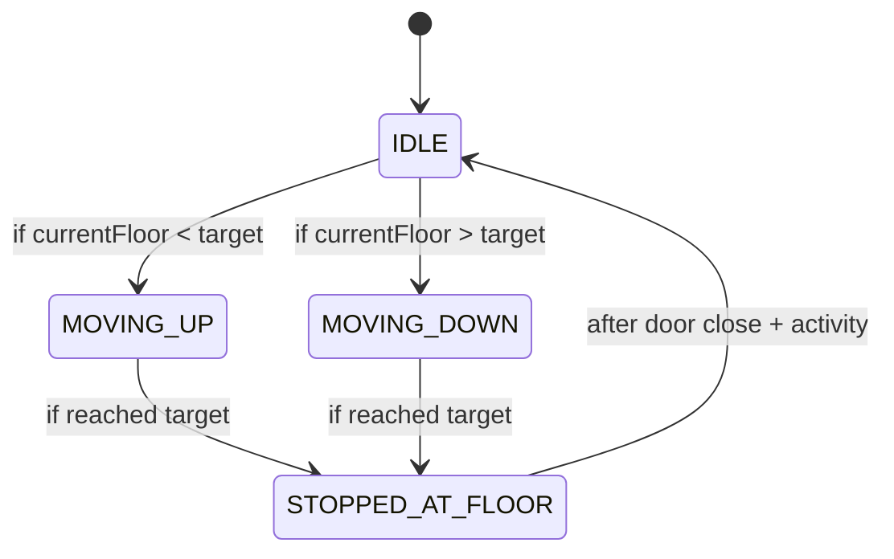
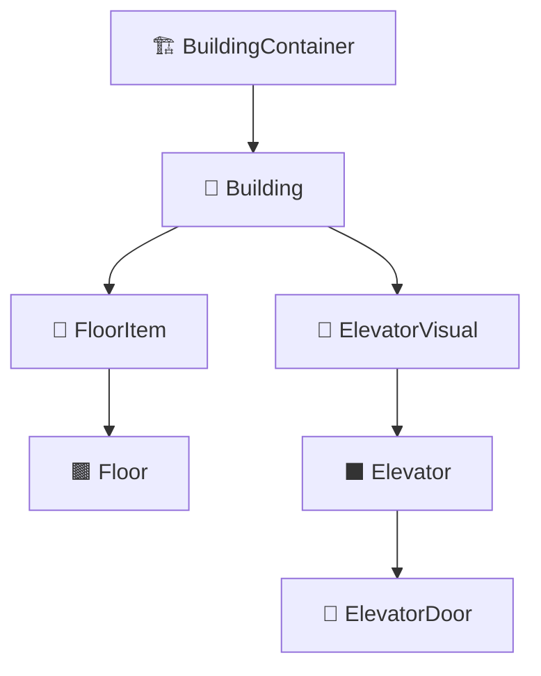
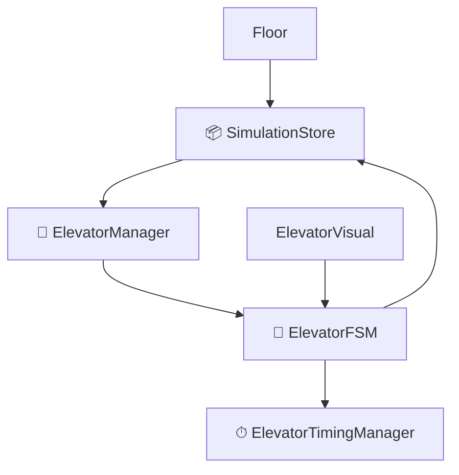

# 🚀 Elevator Simulation System

A TypeScript + React-based elevator system simulation with modular architecture, real-time animations, and intelligent elevator dispatching.

---

## 📦 Tech Stack

- **React + TypeScript** – UI
- **Zustand** – State Management
- **Object-Oriented Design** – `ElevatorFSM`, `ElevatorManager`, Factories
- **Mermaid.js** – Diagrams

---

## 📐 Design Principles

We implemented classic software engineering patterns to ensure scalability and clarity:

- **State Pattern** – Elevator state machine (`ElevatorFSM`)
- **Strategy Pattern** – Optimal elevator dispatch
- **Factory Pattern** – Manager and request creation
- **Observer Pattern** – React & Zustand integration
- **Command Pattern** – `requestElevator()` actions
- **MVC** – Modular separation between logic and UI

---

## 📊 System Architecture

<details>
<summary>Click to expand diagrams</summary>

### 🔁 Design Patterns Overview
```mermaid
graph TD
State[🧠 State Pattern<br>ElevatorFSM controls state] --> FSM[🚪 ElevatorFSM]
Strategy[🎯 Strategy Pattern<br>Dispatch algorithm] --> Manager[🧠 ElevatorManager]
Factory[🏭 Factory Pattern<br>Factories for managers & requests] --> Factories[🛠 Factories]
Observer[👀 Observer Pattern<br>Zustand + React] --> Zustand[📦 Zustand Store]
Composition[🧩 Component Composition<br>React UI structure] --> React[⚛️ React Components]
Command[📥 Command Pattern<br>requestElevator()] --> Manager
Command --> FSM
MVC[📐 MVC Pattern<br>Model + View + Controller] --> FSM
MVC --> React
MVC --> Zustand
```

### 🧠 ElevatorFSM – State Transitions


### ⏱ Tick Flow – Simulation Clock Cycle
```mermaid
graph TD
  Tick[⏱ tick()] --> UpdateFSM[🔁 Update Each ElevatorFSM]
  UpdateFSM --> TimeForward[⏩ Advance Sim Time]
  TimeForward --> UpdateFloorStatuses[📊 updateFloorStatuses()]
```

### 🧱 Component Hierarchy


### 🧩 Zustand + FSM Data Flow


### 📥 RequestElevator Flow
```mermaid
graph TD
  UserClick[👆 User clicks Call Button] --> CallFunc[📞 Floor.onRequest()]
  CallFunc --> StoreFunc[🧭 SimulationStore.requestElevator()]
  StoreFunc --> ManagerDispatch[🧠 ElevatorManager.handleRequest()]
  ManagerDispatch --> AssignFSM[🚪 ElevatorFSM.addStop()]
  AssignFSM --> UpdateFloorStatus[📊 updateFloorStatuses()]
```

### 🧑‍💼 Activity Diagram – Elevator Request Handling
```mermaid
flowchart TD
  Start([Start]) --> ButtonPress[User presses Floor Button]
  ButtonPress --> requestElevator[Store: requestElevator()]
  requestElevator --> handleRequest[Manager: handleRequest()]
  handleRequest --> bestElevator[Select best ElevatorFSM]
  bestElevator --> addStop[ElevatorFSM: addStop()]
  addStop --> UpdateStatus[updateFloorStatuses()]
  UpdateStatus --> End([End])
```
</details>

---

## 🧪 Features

- Multi-building simulation
- Elevator queueing with ETA calculation
- Realtime elevator animation
- Configurable timing settings per elevator
- Visual indication of requests and states

---

## 🛠 Getting Started

### 1. Clone the repo
```bash
git clone https://github.com/your-username/elevator-simulator.git
cd elevator-simulator
```

### 2. Install dependencies
```bash
npm install
```

### 3. Run the development server
```bash
npm run dev
```

---

## ✍️ Author

Built by [Your Name], 2025.

---

## 📜 License

MIT
