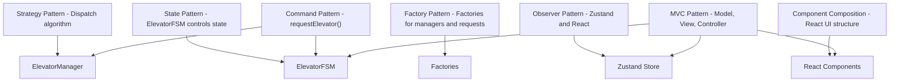
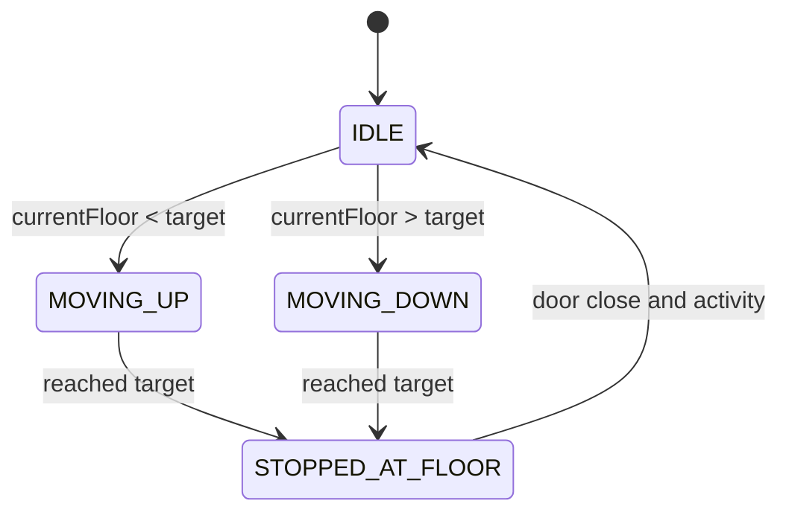
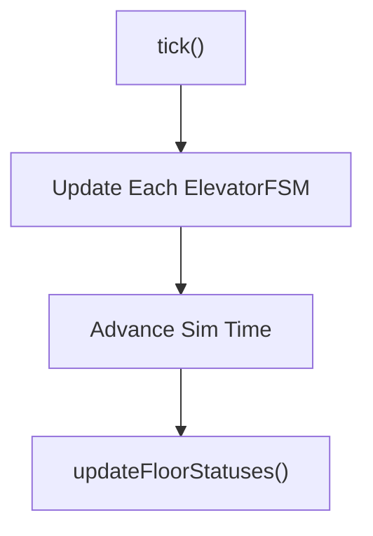
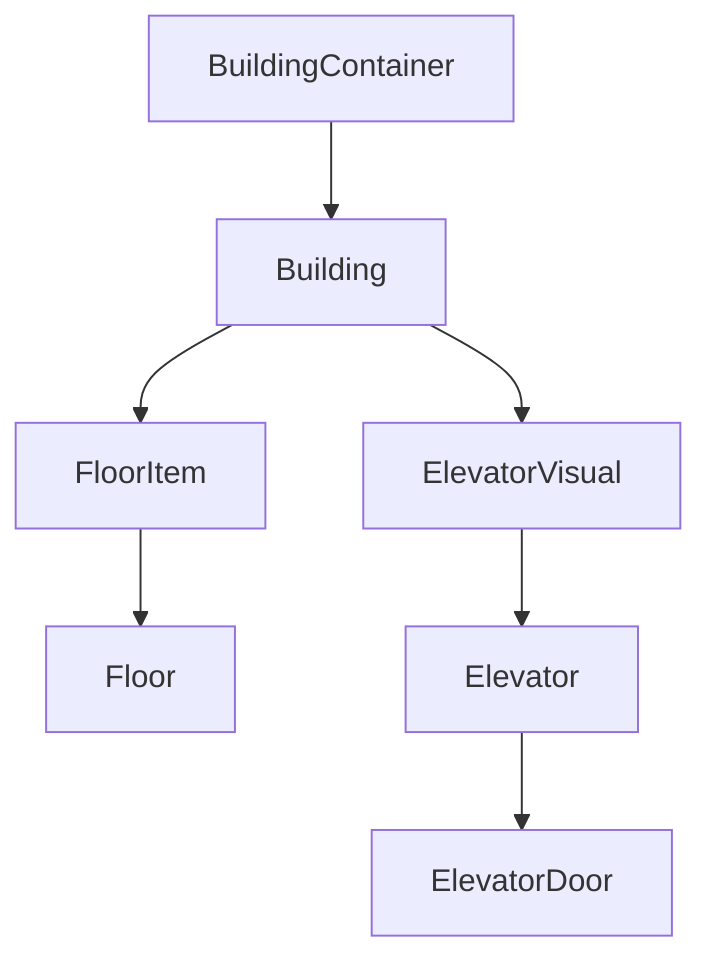
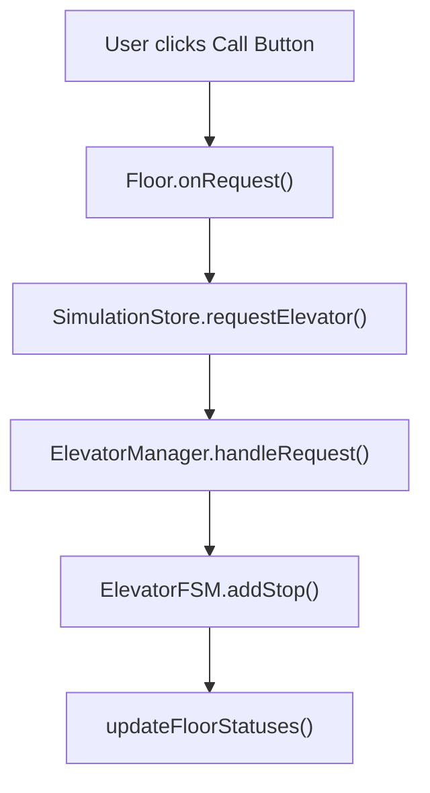
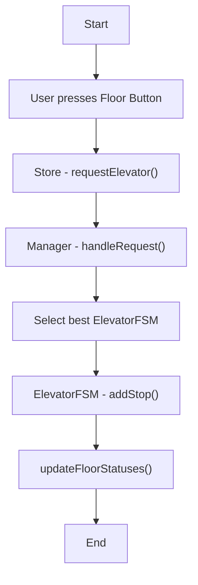

# Elevator Simulation System

A TypeScript + React-based elevator system simulation with modular architecture, real-time animations, and intelligent elevator dispatching.

---

## Tech Stack

- **React + TypeScript** – UI
- **Zustand** – State Management
- **Object-Oriented Design** – `ElevatorFSM`, `ElevatorManager`, Factories
- **Mermaid.js** – Diagrams

---

## Design Principles

We implemented classic software engineering patterns to ensure scalability and clarity:

- **State Pattern** – Elevator state machine (`ElevatorFSM`)
- **Strategy Pattern** – Optimal elevator dispatch
- **Factory Pattern** – Manager and request creation
- **Observer Pattern** – React & Zustand integration
- **Command Pattern** – `requestElevator()` actions
- **MVC** – Modular separation between logic and UI

---

## System Architecture

<details>
<summary>Click to expand diagrams</summary>

### Design Patterns Overview


### ElevatorFSM – State Transitions


### Tick Flow – Simulation Clock Cycle


### Component Hierarchy


### Zustand + FSM Data Flow


### RequestElevator Flow


### Activity Diagram – Elevator Request Handling

</details>

---

## Features

- Multi-building simulation
- Elevator queueing with ETA calculation
- Realtime elevator animation
- Configurable timing settings per elevator
- Visual indication of requests and states

---

## Getting Started

### 1. Clone the repo
```bash
git clone https://github.com/your-username/elevator-simulator.git
cd elevator-simulator
```

### 2. Install dependencies
```bash
npm install
```

### 3. Run the development server
```bash
npm run dev
```

---

## Author

Built by [Your Name], 2025.

---

## License

MIT
